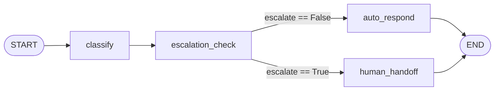
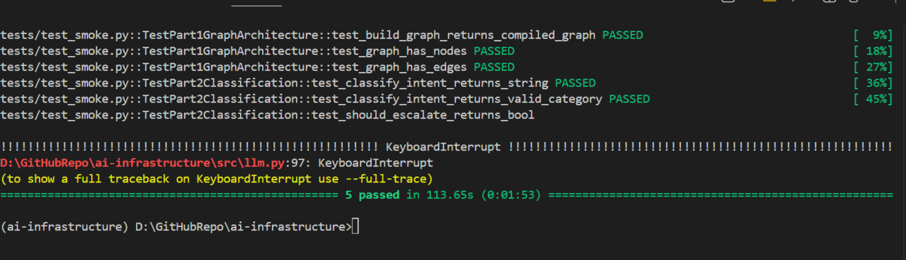
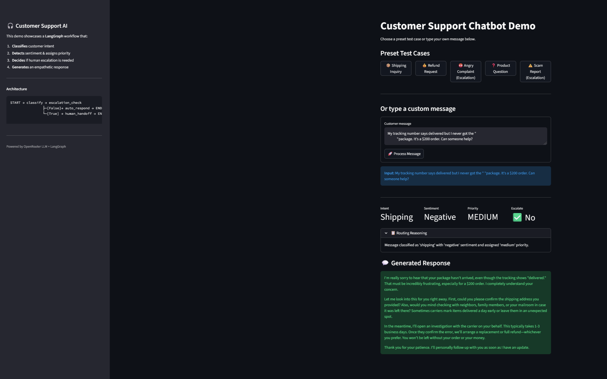

# AI Infrastructure Coding Test: Customer Support Workflow

You've been hired as an AI engineer at a mid-size e-commerce company. The customer support team is overwhelmed — they handle 500+ tickets per day across refunds, shipping inquiries, product questions, and complaints. Leadership wants you to build an AI-powered support workflow that can automatically classify, route, and draft responses to customer messages.

Your job: design and implement a **LangGraph workflow** that processes customer support messages end-to-end.

## Time Limit

**2–3 hours.**

## Getting Started

```bash
# 1. Set up Python environment
cd ai-infrastructure
python -m venv venv
source venv/bin/activate    # Windows: venv\Scripts\activate
pip install -r requirements.txt

# 2. Set up OpenRouter API key
cp .env.example .env
# Edit .env and add your API key from https://openrouter.ai/
# Use any free model (look for models with :free suffix)

# 3. Verify setup
pytest tests/test_smoke.py -v   # will fail until you implement the functions
```

---

## Architecture Flow



| Node | Purpose |
|------|---------|
| `classify` | Classifies intent, detects sentiment, assigns priority, writes reasoning |
| `escalation_check` | Determines if the ticket requires human escalation |
| `auto_respond` | Generates an automated customer-facing response |
| `human_handoff` | Generates a handoff message for human agents |

---

## Your Tasks

### Part 1: Graph Architecture (~45 min)

**File to implement:** `src/workflow.py` → `build_graph()`

Design and build a LangGraph `StateGraph` for the customer support workflow. Your graph should define the processing pipeline — what steps happen, in what order, and how messages get routed.

The state schema is defined in `src/state.py` (`SupportState`). Read it carefully — your nodes will read from and write to this state.

| Function | Returns |
|----------|---------|
| `build_graph()` | A compiled LangGraph `StateGraph`, invokable with `graph.invoke({"customer_message": "..."})` |

**Requirements:**
- Use `SupportState` as the state schema
- At least 2 nodes
- Edges connecting the nodes (use conditional edges for routing)
- Must compile successfully

---

### Part 2: Node Implementation (~1 hr)

**File to implement:** `src/workflow.py` → `classify_intent()`, `should_escalate()`

Implement the core logic for your workflow nodes:

1. **Intent classification** — use the provided `call_llm()` helper to classify customer messages into one of 5 categories: `refund`, `shipping`, `product_inquiry`, `complaint`, `general`.

2. **Escalation detection** — determine if a ticket should be escalated to a human agent based on tone, threats, repeated issues, etc.

You may also implement additional helper functions for other nodes in your graph (e.g., response generation, sentiment analysis, priority assignment).

| Function | Returns |
|----------|---------|
| `classify_intent(message)` | `str` — one of `INTENT_CATEGORIES` |
| `should_escalate(state)` | `bool` — `True` if the ticket needs human attention |

---

### Part 3: End-to-End Execution (~30 min)

**File to implement:** `src/workflow.py` → `process_message()`

Wire everything together. This function should build the graph, run a customer message through it, and return the fully populated state.

Test your workflow with the sample messages in `src/config.py`. Iterate on your prompts and logic to improve classification accuracy and response quality.

| Function | Returns |
|----------|---------|
| `process_message(message)` | `dict` with `customer_message`, `intent`, `sentiment`, `priority`, `response`, `escalate`, `reasoning` |

---

## What's Already Provided (do not modify)

- `src/state.py` — `SupportState` TypedDict (the graph's state schema)
- `src/config.py` — intent categories, priority levels, escalation signals, and 12 sample messages
- `src/llm.py` — `call_llm()` helper that calls a free model on OpenRouter
- `tests/test_smoke.py` — type and shape checks for your functions

---

## Evaluation Criteria

| Area | What We Look For |
|------|-----------------|
| **Graph Design** | Logical node decomposition, meaningful routing with conditional edges, good use of state |
| **Classification** | Accurate intent classification with well-crafted LLM prompts |
| **Escalation** | Smart escalation logic (not just keyword matching or always-true) |
| **Response Quality** | Context-aware, empathetic responses that differ by intent |
| **Code Quality** | Clean, readable code with clear comments or docstrings |

**Bonus (not required):** sentiment-based routing, priority-based response tone, error handling for LLM failures, testing with all sample messages.

---

## Self-Check

Run the smoke tests before submitting to make sure your functions have the right structure:

```bash
cd ai-infrastructure
pytest tests/test_smoke.py -v
```

---

## Project Structure

```
ai-infrastructure/
├── README.md               ← You are here
├── .env.example            ← Template for API key
├── requirements.txt        ← Python dependencies
├── src/
│   ├── state.py            ← SupportState schema (provided)
│   ├── config.py           ← Constants and sample messages (provided)
│   ├── llm.py              ← LLM helper function (provided)
│   └── workflow.py         ← TODO: implement 4 functions
└── tests/
    └── test_smoke.py       ← Smoke tests (provided)
```

Good luck!

--- 

## pytest tests/test_smoke.py -v : Results






